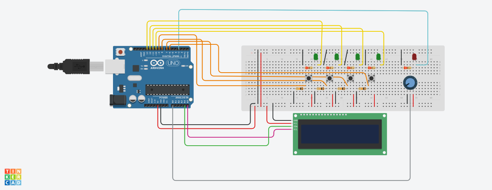

# 🎮 Turn on the Sequence! (TOS)

> A memory-based reaction game built on Arduino — race against the clock to light up the correct LED sequence before time runs out.



---

## What is TOS?

**Turn on the Sequence!** is an embedded game running on an Arduino microcontroller. The game displays a random 4-digit sequence on an LCD/OLED screen, and the player must press the corresponding buttons to light up the LEDs in that exact order — before time expires.

Each successful round increases your score and *reduces the time limit*, making the game progressively harder. One wrong press or a timeout ends the game.

### Hardware components
- 4 green LEDs (L1–L4) + 1 red LED (LS)
- 4 tactile buttons (B1–B4)
- 1 potentiometer (difficulty selector)
- LCD 1602 or SH1106 OLED display (I²C)

---

## Gameplay

1. **Idle state** — the red LED pulses while waiting. Press **B1** to start. If no input is received within 10 seconds, the system enters deep sleep (wake with B1).
2. **Round start** — a random 4-digit sequence (digits 1–4, all distinct) appears on the display.
3. **Player input** — press the buttons in the displayed order. Each correct press lights up the corresponding LED.
4. **Success** → score increases, time limit shrinks, next round begins.
5. **Failure** (wrong button or timeout) → red LED turns on for 2 seconds, final score is displayed, then the game resets.

**Adjust difficulty** with the potentiometer before starting — it controls how aggressively the time limit decreases each round (levels 1–4).

---

## Project Architecture

The project is built with a **modular, procedural design** in C++, running on a **super-loop** control architecture.

```
.
├── include/
│   ├── config.h                  # Global configuration (pins, timings, difficulty)
│   ├── io.h                      # I/O abstraction
│   ├── input.h                   # Input handling interface
│   ├── button/
│   │   └── button.h
│   ├── display/
│   │   ├── display.h             # Display abstraction layer
│   │   ├── lcd_display.h
│   │   └── oled_display.h
│   ├── game/
│   │   └── game.h                # Game logic interface
│   ├── led/
│   │   └── led.h
│   ├── potentiometer/
│   │   └── potentiometer.h
│   └── state/
│       └── fsm.h                 # Finite state machine interface
├── src/
│   ├── main.cpp                  # Entry point, super-loop
│   ├── io.cpp
│   ├── button/
│   │   └── button.cpp
│   ├── display/
│   │   ├── display.cpp
│   │   ├── lcd_display.cpp
│   │   └── oled_display.cpp
│   ├── game/
│   │   └── game.cpp
│   ├── led/
│   │   └── led.cpp
│   ├── potentiometer/
│   │   └── potentiometer.cpp
│   └── state/
│       └── fsm.cpp               # FSM implementation
├── platformio.ini
└── circuit-diagram.png
```

Each hardware component lives in its own module under `src/` and `include/`, exposing only abstract methods through its header. The FSM in `state/fsm.cpp` acts as the central coordinator — handling state transitions, timing, and difficulty management — while delegating all hardware interaction to the individual modules. No object-oriented patterns are used; the architecture relies entirely on clean module boundaries and C-style encapsulation.

---

## Display Support

The project supports two I²C display types out of the box:

| Display | Driver | Library |
|---|---|---|
| LCD 1602 | `lcd_display` | `LiquidCrystal_I2C.h` |
| SH1106 OLED | `oled_display` | `U8g2lib.h` (character mode, no RAM buffer) |

Any display compatible with these libraries should work with minimal changes to the respective display module.

**To switch between LCD and OLED**, set the build flag in `platformio.ini`:

```ini
build_flags = -D USE_OLED
```

Or configure a dedicated PlatformIO environment per display type.

### A note on memory

The Arduino Uno has only **2 KB of SRAM**. The OLED display in particular was a challenge — the `Adafruit_SH1106` library kept a full frame buffer in RAM, which proved too costly. `U8g2lib` in `u8x8` character-only mode was chosen as a replacement: same display support, zero frame buffer overhead. The rest of the codebase was optimized accordingly to stay within the available memory budget.

---

## Build & Flash

This project uses **PlatformIO**.

```bash
# Clone the repo
git clone https://github.com/NotArtyh/iot-assignment-01
cd iot-assignment-01

# Build
pio run

# Upload
pio run --target upload
```

Make sure your `platformio.ini` targets the correct board and serial port.

---

## Authors

- **Arthur Istvan Muller**
- **Giuseppe Cattolico**
